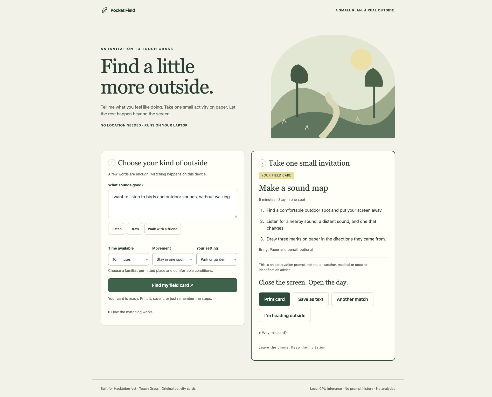

# Pocket Field

A local, open-source AI activity picker for a shorter screen session and a little time outside. Describe what sounds good, choose a time budget, movement preference and outdoor setting, then take one small card with you.

Built from a new project on October 6, 2026 for [Hacktoberfest Week 1: Touch Grass](https://dev.to/challenges/hacktoberfest-week1-2026-10-05).



[Video walkthrough](https://raw.githubusercontent.com/widechaos/pocket-field/main/docs/demo.mp4) · [Mobile card](docs/03-outside-mobile.jpg) · [Downloaded text card](docs/sample-card.txt)

## Run locally

Use Python 3.12. No account, API key, GPU or paid service is needed. Initial package installation and model download need internet access; cached inference works offline.

```sh
python3.12 -m venv .venv
.venv/bin/python -m pip install -r requirements.lock
POCKET_FIELD_CACHE=.cache/models .venv/bin/python server.py
```

Open http://127.0.0.1:8797. To start with cached weights offline:

```sh
POCKET_FIELD_CACHE=.cache/models HF_HUB_OFFLINE=1 TRANSFORMERS_OFFLINE=1 .venv/bin/python server.py
```

The server binds only to the laptop's loopback interface. This is a laptop app with a responsive browser interface, not a hosted mobile service. A phone cannot reach the loopback address on a different laptop. Print or save the card before going outside. `PORT` can change the default port if needed.

## How it works

The open-weight [all-MiniLM-L6-v2](https://huggingface.co/sentence-transformers/all-MiniLM-L6-v2) model, pinned to revision `1110a243fdf4706b3f48f1d95db1a4f5529b4d41`, creates normalized 384-dimensional sentence embeddings on CPU through Sentence Transformers. It compares a request with 16 original activity descriptions using cosine similarity. Time, movement and setting are hard filters applied before ranking. Up to three candidates are available; only one card is displayed at a time. A score below 0.20 returns no match. That threshold is a heuristic, not a calibrated confidence estimate.

The activity instructions are authored content. The model chooses among them; it does not generate routes, weather forecasts, species identifications or medical advice. No location is requested. Input stays in process memory for inference, is not saved, and is not sent to an external API. No external web assets, telemetry or request logs are used. Once weights are cached, runtime does not need the network.

## Checks and honest limits

With the server running:

```sh
.venv/bin/python -m unittest discover -s tests -v
.venv/bin/python evaluate.py
```

Eight integration tests cover semantic paraphrases, constrained ranking, invalid and unrelated inputs, no feasible activity, cross-origin rejection and unexpected Host rejection. Eight author-written diagnostic requests retrieved the intended card first in 8/8 cases, and within the first three in 8/8. The recorded median warm request time was 4.86 ms on the development laptop; see [raw diagnostic output](docs/evaluation.json). These small tests are not an independent benchmark, a field study, or evidence of behavior change. Cold start/model download are not included in that timing. English is the supported input language. The set is deliberately small; unsupported requests may still be matched imperfectly.

The browser was checked at a 375 px mobile viewport with no horizontal overflow, and the downloaded text card was inspected. Print styling is provided, but print-preview verification was inconclusive in the automation session. The video is a walkthrough of real captured screen states, not an outdoor-use recording. I have not field-tested the card outdoors yet.

## Open innovation

The weights and inference code can be inspected, cached and swapped without an API subscription. Local inference keeps this small planning step available without a server connection. The editable activity catalog also makes the recommendations understandable: a contributor can improve a card or add an accessible alternative without retraining a model. A model change should come with fresh diagnostic results rather than reusing these numbers.

## Credits and license

Original application code, cards and SVG illustration: Renchao Wu, MIT license. The model weights are Apache-2.0 according to the linked model card; their license is separate from this application's MIT license. Dependencies keep their respective licenses. No model weights are redistributed in this repository.
